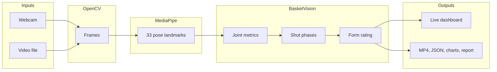
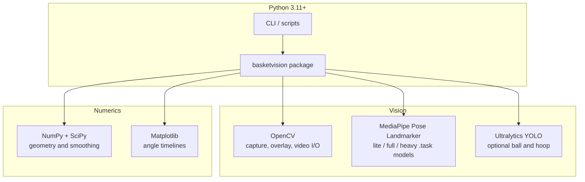
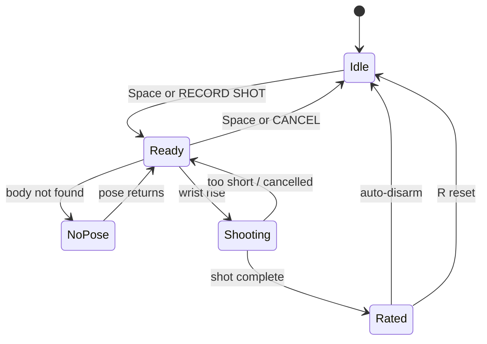
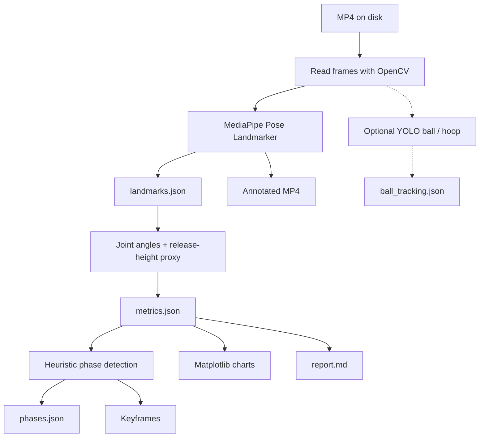

# BasketVision

Local-first basketball shooting form analysis. Capture a jump shot from a webcam or a video file, extract pose landmarks, score mechanics, and write annotated playback plus a coaching report — all on your machine.

No database, web server, or cloud storage. Frames never leave the local pipeline.

[Requirements](#requirements) · [Setup](#setup) · [Live camera](#live-camera) · [Video analysis](#video-analysis) · [Architecture](#architecture)

---

## What it does

- Live webcam dashboard with skeleton overlay, one-shot recording, and an on-screen 0–100 form score
- Automatic jump-shot detection from shooting-wrist rise and fall
- Offline video analysis that writes landmarks, metrics, phases, charts, keyframes, and a Markdown report
- Heuristic phase labels: gather → set point → release → follow-through → landing
- Optional YOLO ball and hoop tracking once pose-only analysis is solid

Stand mostly sideways or at about 45° so the shooting arm is visible, then take a normal jump shot.

---

## Requirements

| Need | Detail |
| --- | --- |
| Python | 3.11 or newer |
| OS | macOS, Linux, or Windows with a working camera or local MP4 |
| Core stack | OpenCV, MediaPipe Pose Landmarker, NumPy, SciPy, Matplotlib |
| Optional | Ultralytics YOLO for ball / hoop tracking |

---

## Architecture

BasketVision is a local computer-vision pipeline, not a web app. Two entry points share the same pose, metric, phase, and rating code.



### Tech stack



| Layer | Role |
| --- | --- |
| OpenCV | Camera capture, mirrored preview, skeleton overlay, annotated MP4, keyframe stills |
| MediaPipe | 33 body landmarks per processed frame, including world coordinates |
| NumPy / SciPy | Joint angles, midpoints, timeline smoothing |
| Matplotlib | Per-metric angle charts for video runs |
| Ultralytics YOLO | Optional basketball / rim detection (`ball_tracking.json`) |

MediaPipe models download on first use into `models/` (`pose_landmarker_lite.task` by default).

---

## Workflows

### Live shot loop

Arm one attempt, shoot, then read the score. Detection watches wrist height; scoring still uses the configured shooting hand.



**Controls**

| Input | Action |
| --- | --- |
| Click **RECORD SHOT** or `Space` | Arm or cancel the next attempt |
| `r` | Reset the detector and clear the last rating |
| `q` / `Esc` | Quit |

Status labels on the dashboard: Click Record → Ready → Analyzing → Shot Rated, plus Body Not Found, Tracking, and Resetting.

### Offline analysis pipeline

A file in `data/uploads/` is processed end to end. Every Nth frame can be sampled for faster development runs.



---

## Form rating

The scorer is deterministic: it compares phase snapshots against coaching ranges and averages the usable categories into a 0–100 overall score.

| Category | What is measured |
| --- | --- |
| Set point | Shooting elbow near 90° at the set |
| Elbow extension | Shooting elbow opened at release |
| Arm elevation | Shoulder angle at release |
| Leg load | Knee bend during gather |
| Guide hand | Soft off-hand, not locked out |
| Release height | Wrist high in the frame |

Release is estimated as the frame where the shooting wrist is highest. That is intentionally simple; ball tracking can tighten timing later.

Core angles: shooting elbow, shoulder, hip, and knee; guide elbow; release-height proxy (`1 - wrist_y`).

---

## Setup

```bash
python3 -m venv .venv
source .venv/bin/activate
python -m pip install -e ".[dev]"
```

On Windows, activate with `.venv\Scripts\activate`.

---

## Live camera

```bash
python scripts/live_camera.py
```

Same command via the installed entry point:

```bash
basketvision-live
# equivalent:
python -m basketvision.cli live
```

Useful flags:

```bash
python -m basketvision.cli live --camera 0 --shooting-hand right
python -m basketvision.cli live --no-mirror --shooting-hand left
python -m basketvision.cli live --model-size full
```

| Flag | Default | Description |
| --- | --- | --- |
| `--camera` | `0` | Webcam device index |
| `--shooting-hand` | `right` | Arm used for form scoring |
| `--no-mirror` | off | Disable mirrored preview |
| `--model-size` | `lite` | MediaPipe model: `lite`, `full`, or `heavy` |
| `--model-dir` | `models` | Where `.task` files are stored |

---

## Video analysis

Put a jump-shot clip in `data/uploads/`, then run:

```bash
python scripts/analyze_video.py data/uploads/user-shot.mp4
```

Or:

```bash
basketvision-analyze data/uploads/user-shot.mp4
python -m basketvision.cli analyze data/uploads/user-shot.mp4
```

| Flag | Default | Description |
| --- | --- | --- |
| `--output-root` | `outputs` | Parent folder for per-video results |
| `--shooting-hand` | `right` | Arm used for metrics and overlay highlight |
| `--sample-every` | `1` | Process every Nth frame |
| `--max-frames` | none | Cap frames for quick test runs |
| `--model-size` | `lite` | MediaPipe model size |
| `--enable-ball-tracking` | off | Run optional YOLO detection |
| `--yolo-model` | `yolo11n.pt` | YOLO weights name or path |

Each run writes:

```text
outputs/user-shot/
  landmarks.json
  metrics.json
  phases.json
  keyframes/          gather, set point, release, follow-through, landing
  charts/             one PNG timeline per metric
  annotated.mp4       skeleton overlay, shooting side in orange
  report.md           metadata, ranges, and first-pass coaching notes
```

Details: [Shot metrics](docs/metrics.md) · [Visualizations](docs/visualizations.md) · [Ball tracking](docs/ball_tracking.md)

---

## Optional ball tracking

Pose-only analysis is the default. Install YOLO when you want ball and hoop detections:

```bash
python -m pip install -e ".[yolo]"
python scripts/analyze_video.py data/uploads/user-shot.mp4 --enable-ball-tracking
```

That adds `ball_tracking.json` to the output folder. A custom model trained on basketball, rim, and backboard will outperform the generic detector.

---

## Project layout

```text
basketvision/          Analysis library
  cli.py               analyze + live entry points
  camera.py            Live OpenCV dashboard
  live_detector.py     Wrist-rise shot detection
  pose.py              MediaPipe landmarker + model download
  analysis.py          Video pipeline
  metrics.py           Joint angles
  phases.py            Heuristic shot phases
  rating.py            0–100 form score
  drawing.py           Overlays and live HUD
  report.py / charts.py
scripts/               Thin wrappers around the CLI
docs/                  Metrics, visuals, and YOLO notes
tests/
data/uploads/          Input videos (gitignored)
outputs/               Generated artifacts (gitignored)
models/                Downloaded MediaPipe .task files
```

---

## Development

```bash
.venv/bin/ruff check .
.venv/bin/python -m pytest -q
.venv/bin/python -m compileall -q basketvision scripts
git diff --check
```

When changing live detection, exercise idle, armed/ready, no-pose, shooting, rated, reset, and cancellation. When changing video analysis, confirm MP4, JSON, Markdown, chart, and keyframe outputs.

---

## Roadmap

Local camera and video analysis stay the priority. Next opportunities:

- Session history with scores over time
- Saved live-shot clips and exportable reports
- On-screen framing / calibration guide
- Countdown and audible cues when recording is armed
- Remembered camera, shooting-hand, and mirror preferences
- Automatic shooting-hand detection with a manual override
- Tighter release timing via ball and hoop tracking
- Side-by-side comparison against a reference shot
